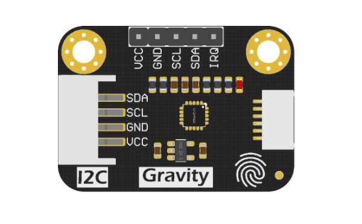
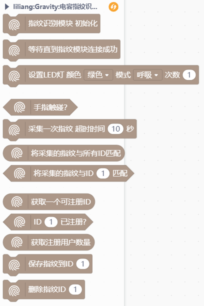
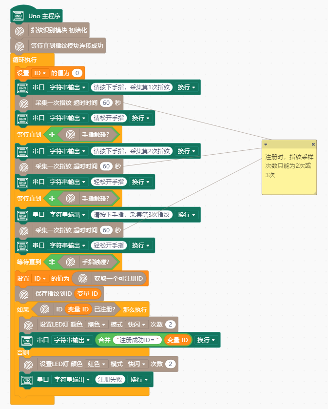

# Gravity 电容指纹模块




---------------------------------------------------------

## Table of Contents

* [URL](#url)
* [Summary](#summary)
* [Blocks](#blocks)
* [License](#license)
* [Supported targets](#Supportedtargets)

## URL
* Project URL : ```https://github.com/liliang9693/ext-GravityID809```

* Tutorial URL : ```https://mindplus.dfrobot.com.cn/extensions-user```

* wiki URL : ```http://wiki.dfrobot.com.cn```


## Summary
此扩展支持DFRobot出品的Gravity:电容指纹识别模块。

## Blocks




## Examples



## License

MIT

## Supported targets

MCU                | JavaScript    | Arduino   | MicroPython    | Remarks
------------------ | :----------: | :----------: | :---------: | -----
arduino        |             |        √      |             | 
micro:bit        |             |       √       |             | 
esp32        |             |        √      |             | 


## Release Logs
* V0.0.1  基础功能完成

